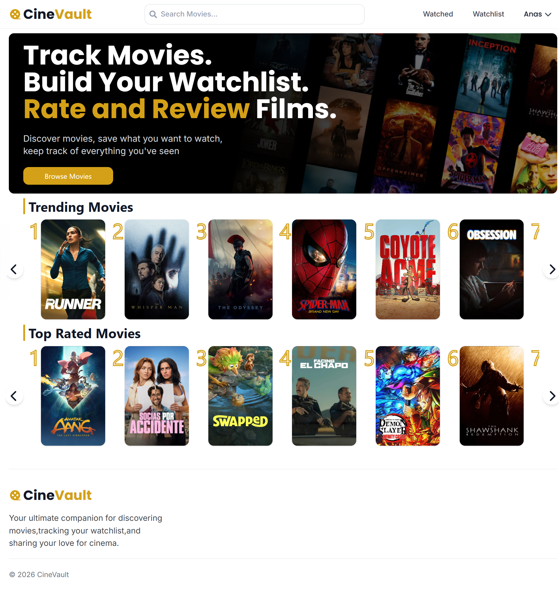
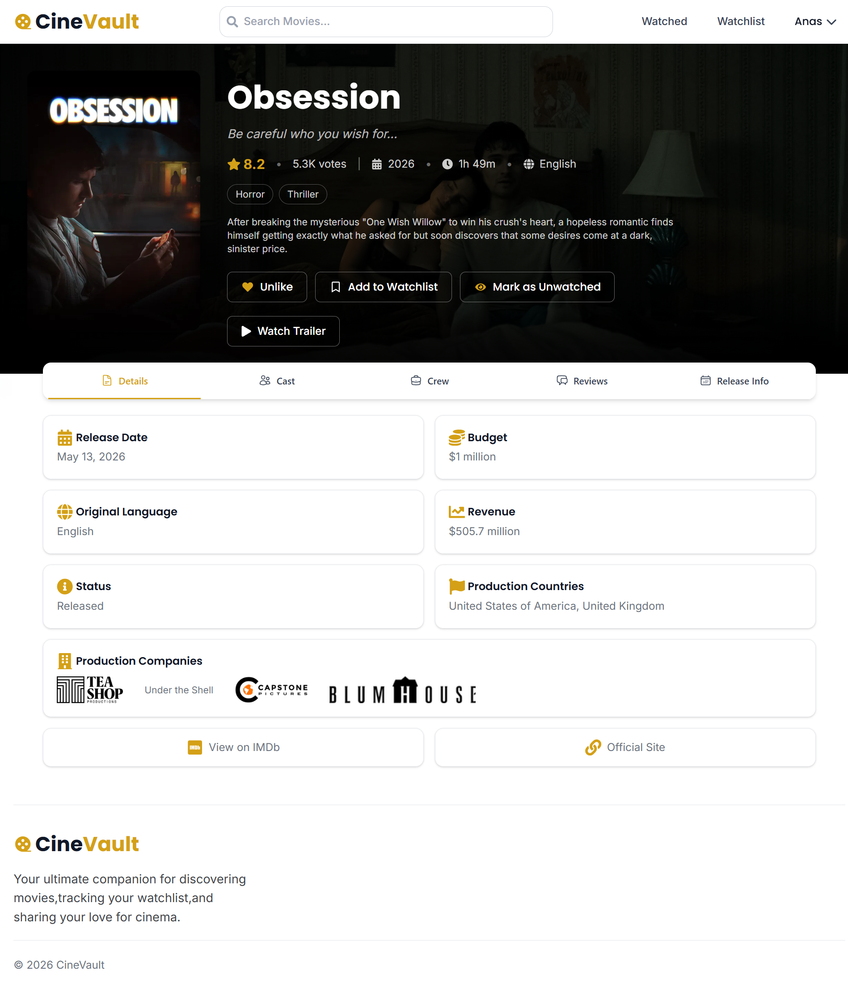
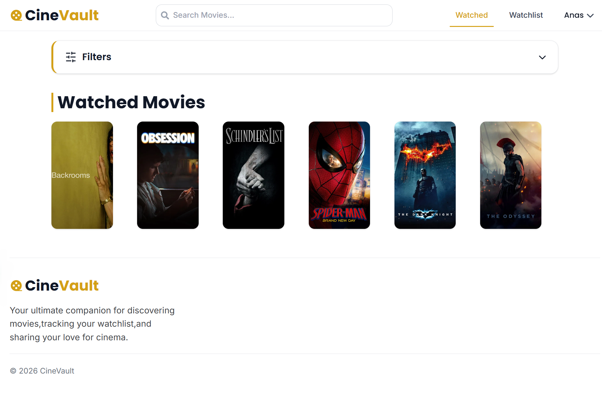
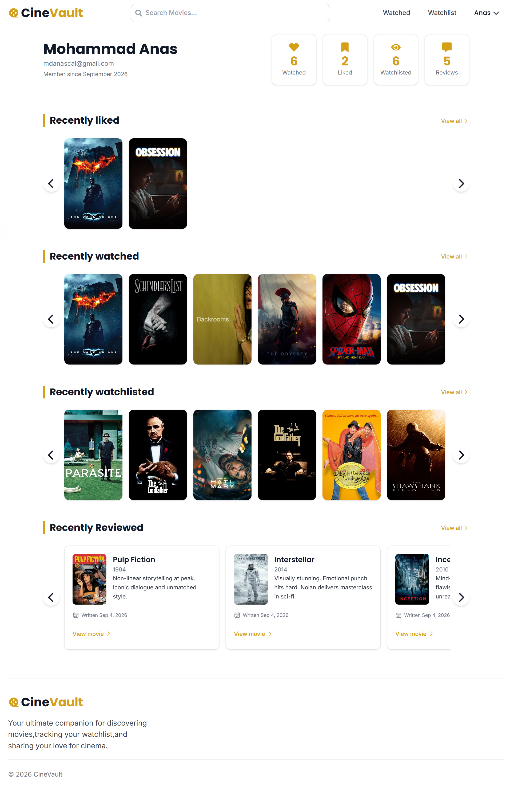

# CineVault


CineVault is a solo, full-stack MERN movie-tracking project inspired by Letterboxd. It uses [TMDB](https://www.themoviedb.org/) data to help users discover films, track personal collections, and write reviews.

- Live demo: [CineVault](https://cine-vault-pink.vercel.app/)
- Screenshots: see [Screenshots](#screenshots)

## Features

### Discovery and Search

- The home page shows TMDB's trending-weekly and top-rated movie feeds as separate sections.

- Search the TMDB catalogue by title. Results load as you scroll using TanStack Query's `useInfiniteQuery` and an `IntersectionObserver` sentinel. No pagination library is used.

### Movie Pages

- Each movie page shows its overview, TMDB rating data, runtime, genres, languages, cast, crew, release information, and community reviews. A trailer appears when one is available.
- Use dedicated tabs for details, cast, crew, releases, and reviews.

### Account Access

- Sign up with email verification through a JWT-based link that expires after one day.
- Once verified, sign in with a 30-day HTTP-only JWT cookie. Signing out clears it.

### Personal Collections

- Add movies to your Watch History, Watchlist, and Likes. Optimistic updates show changes immediately.

- Narrow each list by release-year range, up to three genres, sort field, and direction. Your Watch History also lets you filter by whether a movie is in your Likes.

- More results load automatically when you reach the bottom of a collection.

### Reviews and Profile

- Write, edit, or delete one review per movie. Filter your review history by date and sort order.

- Your own reviews load as you scroll. Community reviews use a "Load More" button.

- Your profile shows totals and recent activity across Likes, Watch History, Watchlist, and Reviews.

---

## Screenshots

**Home**


**Movie Details**


**Collection**


**Profile**


---

## Tech Stack

| Area         | Technologies                                                                                 |
| ------------ | -------------------------------------------------------------------------------------------- |
| Frontend     | React, React Router, TanStack Query, Tailwind CSS, Vite                                     |
| Backend      | Node.js, Express, MongoDB/Mongoose, JWT authentication, TMDB response caching               |
| API security | bcrypt, HTTP-only cookies, CORS, Helmet, rate limiting, request validation                  |
| Services     | TMDB API, Gmail API/OAuth2                                                                   |
| Tooling      | ESLint, Nodemon, concurrently                                                                |

---

## Getting Started

### Prerequisites

- Node.js LTS and npm
- MongoDB
- TMDB API access token
- Gmail API OAuth2 credentials for verification emails

### Install dependencies

Install dependencies for the root runner and both applications:

```bash
npm install

cd frontend
npm install

cd ../backend
npm install
```

### Configure environment variables

Create `.env` files in `frontend/` and `backend/`. Set `VITE_API_URL` in the frontend, then configure the backend's MongoDB connection, JWT secret, TMDB token, client origin, Gmail OAuth credentials, and sender identity. Keep credentials out of source control.

### Run locally

From the repository root, start both applications:

```bash
npm run dev
```

Use the Vite development-server URL printed at startup and align the frontend API URL and backend client origin with your local addresses.
